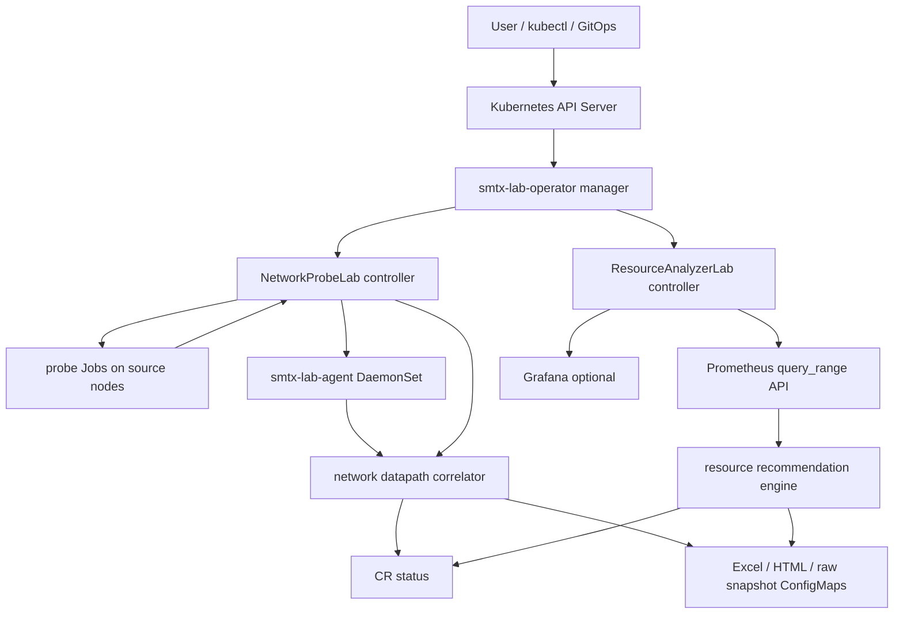
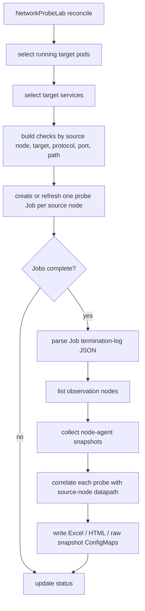
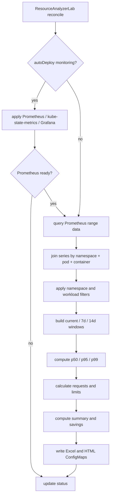

# smtx-lab-operator

`smtx-lab-operator` is a Kubernetes Operator for lab-grade network validation,
network datapath observability, resource usage analysis, resource optimization
recommendations, and report export.

It provides two cluster-scoped CRDs:

- `NetworkProbeLab`: validates pod/service connectivity and records node
  datapath evidence such as CNI, Calico overlay mode, iptables chains, IPVS, and
  conntrack.
- `ResourceAnalyzerLab`: queries Prometheus metrics, analyzes current/7-day/14-day
  usage, computes p50/p95/p99, recommends container requests/limits, and exports
  Excel/HTML reports.

## What It Does

| Capability | Status | Output |
| --- | --- | --- |
| Cross-node PodIP connectivity | Implemented | `NetworkProbeLab.status.probeResults` |
| Service ClusterIP connectivity | Implemented | `NetworkProbeLab.status.probeResults` |
| Service DNS connectivity | Implemented | `NetworkProbeLab.status.probeResults` |
| Calico CNI and overlay detection | Implemented | `status.nodeResults[].cni` |
| iptables datapath chain collection | Implemented | `status.nodeResults[].iptables` |
| Pod-forward vs Service chain grouping | Implemented | `podChains`, `serviceChains` |
| IPVS stats collection | Implemented | `status.nodeResults[].ipvs` |
| conntrack sampling and correlation | Implemented | `status.nodeResults[].conntrack`, probe datapath |
| 14-day resource analysis | Implemented | `ResourceAnalyzerLab.status.recommendations` |
| CPU/memory p50/p95/p99 | Implemented | `status.recommendations[].observed` |
| Current, 7-day, 14-day min/avg/max | Implemented | `status.recommendations[].usage` |
| Resource request/limit recommendation | Implemented | `status.recommendations[].recommended` |
| Excel export | Implemented | ConfigMap binary data |
| HTML dashboard report export | Implemented | ConfigMap binary data |
| Optional Prometheus/Grafana deployment | Implemented | Operator-managed monitoring stack |

## Repository Layout

```text
.
|-- api/v1alpha1                 # CRD API types
|-- cmd/manager                  # controller manager entrypoint
|-- cmd/agent                    # node-agent HTTP server
|-- cmd/probe                    # per-node network probe job binary
|-- config/crd/bases             # generated CRD manifests
|-- config/default               # default install kustomization
|-- config/agent                 # node-agent DaemonSet
|-- config/manager               # manager Deployment and namespace
|-- config/rbac                  # RBAC for manager and agent
|-- config/samples               # sample CRs and nginx workload
|-- deploy                       # generated one-command install YAML and ready CR samples
|-- internal/agent               # CNI, iptables, IPVS, conntrack collection
|-- internal/analyzer            # network correlation and resource recommendation
|-- internal/controller          # NetworkProbeLab and ResourceAnalyzerLab reconcilers
|-- internal/exporter            # Excel and HTML report writers
|-- internal/metrics             # Prometheus query_range client
|-- internal/probe               # probe payload/result types
|-- docs                         # detailed design and validation notes
`-- scripts                      # local e2e helper scripts
```

## Architecture



### Component Responsibilities

| Component | Responsibility |
| --- | --- |
| CRD layer | Defines `NetworkProbeLab` and `ResourceAnalyzerLab` desired state and status |
| Controller layer | Reconciles CRs, creates Jobs, queries agents/Prometheus, updates status, writes reports |
| Probe Job | Runs TCP/UDP/HTTP/HTTPS checks from a selected source node |
| Node agent | Collects read-only host datapath snapshots from each node |
| Metrics layer | Uses Prometheus `query_range` for container usage and request/limit metrics |
| Analysis layer | Correlates network datapath and calculates resource recommendations |
| Export layer | Writes Excel and HTML reports into ConfigMaps |
| Monitoring stack | Optionally deploys Prometheus, kube-state-metrics, and Grafana |

## Quick Start

### Prerequisites

- Kubernetes cluster
- `kubectl`
- Images pushed to a registry reachable by cluster nodes
- Go 1.22+ only if building locally

The deploy manifests use Docker Hub images:

```text
docker.io/lammw12/smtx-lab-operator:v0.1.0
docker.io/lammw12/smtx-lab-agent:v0.1.0
docker.io/lammw12/prometheus:v2.53.1
docker.io/lammw12/kube-state-metrics:v2.13.0
docker.io/lammw12/grafana:11.1.4
docker.io/lammw12/nginx:1.27-alpine
```

For another registry, update:

- `config/manager/manager.yaml`
- `config/agent/daemonset.yaml`
- image fields in sample CRs if needed
- `deploy/install.yaml` and files under `deploy/cr` or regenerate them from
  `config/`

### Install Operator

Fast path with the generated all-in-one manifest:

```bash
kubectl apply -f deploy/install.yaml
kubectl -n smtx-lab-system rollout status deployment/smtx-lab-operator --timeout=180s
kubectl -n smtx-lab-system rollout status daemonset/smtx-lab-agent --timeout=180s
```

Development path with kustomize:

```bash
kubectl apply -k config/default
kubectl -n smtx-lab-system get pods
```

Expected core pods:

```text
smtx-lab-operator
smtx-lab-agent
```

If `ResourceAnalyzerLab.spec.monitoringStack.autoDeploy=true`, the operator also
creates:

```text
smtx-lab-prometheus
kube-state-metrics
smtx-lab-grafana
```

### Deploy Test Workload

```bash
kubectl apply -f deploy/samples/nginx-test-workload.yaml
kubectl -n test get pods -o wide
kubectl -n test get svc
```

The sample workload runs two nginx replicas with anti-affinity so that
cross-node PodIP checks can be exercised.

### Run Network Probe Lab

```bash
kubectl apply -f deploy/cr/networkprobelab-cross-node-calico.yaml
kubectl get networkprobelab cross-node-network-lab
kubectl get networkprobelab cross-node-network-lab -o yaml
```

Short name:

```bash
kubectl get npl
kubectl get npl cross-node-network-lab -o yaml
```

### Run Resource Analyzer Lab

```bash
kubectl apply -f deploy/cr/resourceanalyzerlab-14d-all-namespaces.yaml
kubectl get resourceanalyzerlab resource-14d-analysis
kubectl get resourceanalyzerlab resource-14d-analysis -o yaml
```

Short name:

```bash
kubectl get ral
kubectl get ral resource-14d-analysis -o yaml
```

## Export Reports

Reports are stored as ConfigMap `binaryData`.

### Network Reports

```bash
kubectl -n smtx-lab-system get cm network-probe-lab-report \
  -o jsonpath='{.binaryData.network-probe-results\.xlsx}' \
  | base64 -d > network-probe-results.xlsx

kubectl -n smtx-lab-system get cm network-probe-lab-html-report \
  -o jsonpath='{.binaryData.network-probe-results\.html}' \
  | base64 -d > network-probe-results.html
```

### Resource Reports

```bash
kubectl -n smtx-lab-system get cm resource-analyzer-report \
  -o jsonpath='{.binaryData.resource-recommendations\.xlsx}' \
  | base64 -d > resource-recommendations.xlsx

kubectl -n smtx-lab-system get cm resource-analyzer-html-report \
  -o jsonpath='{.binaryData.resource-recommendations\.html}' \
  | base64 -d > resource-recommendations.html
```

The HTML reports are self-contained pages designed for dashboard-style reading:
summary cards, grouped tables, critical findings, and detailed rows similar to a
Grafana report.

## NetworkProbeLab

### NetworkProbeLab Spec

Important spec fields:

| Field | Description |
| --- | --- |
| `target.namespaces` | Namespaces used to select pods and services |
| `target.podSelector` | Target pods for PodIP checks |
| `target.serviceSelector` | Target services for ClusterIP and DNS checks |
| `target.nodeSelector` | Restricts source and observation nodes |
| `traffic.protocols` | `TCP`, `UDP`, `HTTP`, or `HTTPS` |
| `traffic.ports` | Ports to probe |
| `traffic.count` | Per-check repeat count used for latency percentiles |
| `traffic.timeoutSeconds` | Probe timeout |
| `traffic.crossNodeOnly` | Filters PodIP checks to cross-node targets |
| `traffic.includePodIP` | Enables direct pod IP checks |
| `traffic.includeServiceVIP` | Enables service ClusterIP checks |
| `traffic.includeDNS` | Enables service DNS checks |
| `observability.collectCNI` | Collects CNI type and overlay mode |
| `observability.collectIptables` | Collects filtered `iptables-save` output |
| `observability.collectIPVS` | Collects `/proc/net/ip_vs` statistics |
| `observability.collectConntrack` | Collects filtered conntrack entries |
| `observability.chainAllowlist` | Limits stored iptables chains by glob pattern |
| `output.excel` | Enables Excel report ConfigMap |
| `output.html` | Enables HTML report ConfigMap |
| `output.retainRawSnapshots` | Stores gzipped per-node raw snapshots |

### NetworkProbeLab Status

Important status fields:

| Field | Description |
| --- | --- |
| `observedGeneration` | Latest CR generation reconciled by controller |
| `phase` | `Pending`, `Running`, `Succeeded`, or `Failed` |
| `conditions` | Kubernetes-style condition list |
| `summary.totalTests` | Number of generated probe checks |
| `summary.succeeded` | Successful probe checks |
| `summary.failed` | Failed probe checks |
| `summary.cniDetected` | Distinct CNI types detected on observed nodes |
| `summary.datapathModes` | Distinct kube-proxy/datapath modes |
| `summary.calicoOverlayModes` | Distinct Calico overlay modes |
| `nodeResults` | Per-node CNI, iptables, IPVS, conntrack summary |
| `probeResults` | Per-check result, source/target IPs, latency, datapath |
| `artifacts` | ConfigMap names for Excel, HTML, and raw snapshots |

### Network Probe Flow



The controller uses stable Job names per lab/source node and annotates each Job
with the CR generation and check-list hash. If targets, ports, protocols, or
traffic settings change, stale Jobs are deleted and recreated.

### Probe Count Calculation

For PodIP checks:

```text
podIP checks =
  sum_for_each_source_node(count(targetPods where target.node != source.node))
  * protocol_count
  * port_count
```

For Service VIP and DNS checks:

```text
serviceVIP checks =
  source_node_count * service_count * protocol_count * service_port_count

dns checks =
  source_node_count * service_count * protocol_count * service_port_count
```

Total:

```text
totalTests = podIP checks + serviceVIP checks + dns checks
```

Example from Calico validation:

| Item | Value |
| --- | ---: |
| source nodes | 2 |
| running target pods | 2 |
| cross-node pod pairs | 2 |
| services | 1 |
| protocols | 2 |
| ports | 1 |
| PodIP checks | 4 |
| Service VIP checks | 4 |
| DNS checks | 4 |
| total checks | 12 |
| successful checks | 12 |

### CNI and Overlay Detection

The node agent detects CNI using host CNI config files and network interfaces.

| Signal | Detection |
| --- | --- |
| CNI config contains `calico` | `type=calico`, `mode=iptables` |
| interface starts with `cali` | Calico workload interface |
| interface `tunl0` | Calico IPIP overlay |
| interface `vxlan.calico` | Calico VXLAN overlay |
| config contains `wireguard` | Calico WireGuard hint |
| config contains `cilium` | `type=cilium`, `mode=ebpf` |
| config contains `everoute` | `type=everoute`, `mode=openvswitch` |
| config contains `flannel` | `type=flannel`, `mode=vxlan` |

Current Calico support records:

- `ipip`
- `vxlan`
- `wireguard`
- `none-or-bgp`

### iptables, IPVS, and conntrack

The agent collects iptables with:

```bash
iptables-save
```

The output is bounded by byte size and optionally filtered by
`spec.observability.chainAllowlist`. The analyzer groups chains into two
high-signal categories:

| Category | Chain examples | Meaning |
| --- | --- | --- |
| `pod-forward` | `cali-*`, `KUBE-FORWARD` | Calico workload policy/routing and forwarding paths |
| `service` | `KUBE-SERVICES`, `KUBE-SVC-*`, `KUBE-SEP-*`, `KUBE-MARK-MASQ`, `KUBE-POSTROUTING` | kube-proxy service VIP, endpoint DNAT, and masquerade paths |

IPVS is collected from:

```text
/proc/net/ip_vs
```

conntrack is collected with:

```bash
conntrack -L
```

The conntrack snapshot is filtered by protocol and maximum entry count.
Correlation is best-effort: a probe result is associated with the source-node
snapshot, relevant chains, CNI mode, overlay mode, and matching conntrack tuple
when available.

### NetworkProbeLab Example

```yaml
apiVersion: lab.smtx.io/v1alpha1
kind: NetworkProbeLab
metadata:
  name: cross-node-network-lab
spec:
  target:
    namespaces:
    - test
    podSelector:
      matchLabels:
        app: nginx
    serviceSelector:
      matchLabels:
        app: nginx
  traffic:
    protocols:
    - TCP
    - HTTP
    ports:
    - 80
    count: 6
    timeoutSeconds: 6
    crossNodeOnly: true
    includePodIP: true
    includeServiceVIP: true
    includeDNS: true
  observability:
    collectCNI: true
    collectIptables: true
    collectIPVS: true
    collectConntrack: true
    chainAllowlist:
    - KUBE-*
    - CALI-*
    - cali-*
  output:
    excel:
      enabled: true
      configMapName: network-probe-lab-report
    html:
      enabled: true
      configMapName: network-probe-lab-html-report
    retainRawSnapshots: true
```

## ResourceAnalyzerLab

### ResourceAnalyzerLab Spec

Important spec fields:

| Field | Description |
| --- | --- |
| `target.namespaces` | Optional namespace allowlist |
| `target.excludeNamespaces` | Namespace denylist, usually includes `kube-system` |
| `target.workloadKinds` | Optional workload kind filter |
| `metrics.prometheusURL` | Prometheus endpoint; optional when auto-deploy is enabled |
| `metrics.lookbackDays` | Query window, typically 14 |
| `metrics.step` | Prometheus range query step, default `5m` |
| `metrics.timeoutSeconds` | Query timeout |
| `recommendation.cpu` | CPU percentile/headroom/minimum policy |
| `recommendation.memory` | Memory percentile/headroom/minimum policy |
| `recommendation.languageHints` | Runtime hints for Go, Java, Python, or overrides |
| `monitoringStack.autoDeploy` | Deploy Prometheus, kube-state-metrics, and optional Grafana |
| `output.excel` | Enables Excel report ConfigMap |
| `output.html` | Enables HTML report ConfigMap |

### ResourceAnalyzerLab Status

Important status fields:

| Field | Description |
| --- | --- |
| `observedGeneration` | Latest CR generation reconciled by controller |
| `phase` | `Pending`, `Running`, `Succeeded`, or `Failed` |
| `conditions` | `MonitoringStackReady`, `PrometheusReachable`, `AnalysisCompleted`, export conditions |
| `summary.analyzedNamespaces` | Distinct namespaces analyzed |
| `summary.analyzedWorkloads` | Distinct workloads analyzed |
| `summary.analyzedContainers` | Number of container recommendations |
| `summary.recommendedChanges` | Containers whose current resources differ from recommendation |
| `summary.potentialCpuRequestReductionMillicores` | Positive CPU request reduction sum |
| `summary.potentialMemoryRequestReductionMiB` | Positive memory request reduction sum |
| `recommendations` | Per-container current, observed, usage, recommended values |
| `artifacts` | Excel and HTML ConfigMap names |

### Resource Analyzer Flow



### Prometheus Queries

The controller uses Prometheus `query_range` over:

```text
start = now - lookbackDays * 24h
end = now
step = spec.metrics.step
```

PromQL:

```promql
sum by (namespace,pod,container) (rate(container_cpu_usage_seconds_total{container!="",image!=""}[5m]))
container_memory_working_set_bytes{container!="",image!=""}
kube_pod_container_resource_requests{resource="cpu"}
kube_pod_container_resource_requests{resource="memory"}
kube_pod_container_resource_limits{resource="cpu"}
kube_pod_container_resource_limits{resource="memory"}
```

Series are joined by:

```text
namespace + pod + container
```

The analyzer ignores empty containers and the Kubernetes infra container named
`POD`.

### Usage Windows

For every container:

| Window | Meaning |
| --- | --- |
| `current` | latest CPU and memory samples |
| `last7d` | min, avg, max over samples in the last 7 days |
| `last14d` | min, avg, max over samples in the last 14 days |

Conversions:

```text
CPU cores -> millicores = ceil(cores * 1000)
memory bytes -> MiB = ceil(bytes / 1024 / 1024)
```

If Prometheus has less than 14 days of data, the analyzer still queries 14 days
but computes windows from the samples that actually exist.

### Percentile Calculation

Percentiles are sorted and linearly interpolated:

```text
rank = p * (sample_count - 1)
lower = floor(rank)
upper = ceil(rank)
value = sorted[lower] * (1 - weight) + sorted[upper] * weight
weight = rank - lower
```

Status records:

- CPU p50/p95/p99 in millicores
- memory p50/p95/p99 in MiB

### Recommendation Formula

The implementation uses a conservative production-oriented policy:

- request baseline: `max(percentile, 14d average)`
- limit baseline: `max(percentile, 14d peak)`
- then apply headroom, minimum request, and rounding

CPU:

```text
cpuRequestBase = max(cpuP95, last14d.cpuAvg)
cpuRequestRaw = max(ceil(cpuRequestBase * requestHeadroomRatio), minCpuRequest)
cpuRequest = roundCpu(cpuRequestRaw)

cpuLimitBase = max(cpuP99, last14d.cpuMax)
cpuLimitRaw = ceil(cpuLimitBase * languageCpuLimitHeadroom)
cpuLimit = roundCpu(cpuLimitRaw)

if cpuLimit > 0 and cpuLimit < cpuRequest:
  cpuLimit = cpuRequest
```

Memory:

```text
memoryRequestBase = max(memoryP95, last14d.memoryAvg)
memoryRequestRaw = max(ceil(memoryRequestBase * languageMemoryRequestHeadroom), minMemoryRequest)
memoryRequest = roundMemory(memoryRequestRaw)

memoryLimitBase = max(memoryP99, last14d.memoryMax)
memoryLimitRaw = ceil(memoryLimitBase * languageMemoryLimitHeadroom)
memoryLimit = roundMemory(memoryLimitRaw)

if memoryLimit > 0 and memoryLimit < memoryRequest:
  memoryLimit = memoryRequest
```

Rounding:

```text
CPU <= 100m  -> round up to 10m
CPU > 100m   -> round up to 50m
Memory <= 512Mi -> round up to 32Mi
Memory > 512Mi  -> round up to 128Mi
```

Runtime headroom:

| Runtime | CPU limit | Memory request | Memory limit |
| --- | ---: | ---: | ---: |
| Go/default | max(configured, 1.2) | max(configured, 1.1) | max(configured, 1.25) |
| Java | max(configured, 1.5) | max(configured, 1.25) | max(configured, 1.5) |
| Python | max(configured, 1.4) | max(configured, 1.2) | max(configured, 1.35) |

### ResourceAnalyzerLab Example

```yaml
apiVersion: lab.smtx.io/v1alpha1
kind: ResourceAnalyzerLab
metadata:
  name: resource-14d-analysis
spec:
  target:
    excludeNamespaces:
    - kube-system
  metrics:
    lookbackDays: 14
    step: 5m
    timeoutSeconds: 60
  monitoringStack:
    autoDeploy: true
    prometheus:
      enabled: true
    grafana:
      enabled: true
  recommendation:
    cpu:
      requestPercentile: p95
      limitPercentile: p99
      requestHeadroomRatio: 1.2
      limitHeadroomRatio: 1.5
      minRequestMillicores: 50
    memory:
      requestPercentile: p95
      limitPercentile: p99
      requestHeadroomRatio: 1.15
      limitHeadroomRatio: 1.3
      minRequestMiB: 64
    languageHints:
      default: Go
  output:
    excel:
      enabled: true
      configMapName: resource-analyzer-report
    html:
      enabled: true
      configMapName: resource-analyzer-html-report
```

## Inspecting Results

### Network Status Queries

```bash
kubectl get npl cross-node-network-lab -o jsonpath='{.status.phase}{"\n"}'
kubectl get npl cross-node-network-lab -o jsonpath='{.status.summary}{"\n"}'
kubectl get npl cross-node-network-lab -o json | jq '.status.probeResults[] | {sourcePodIP,sourceNodeIP,targetPodIP,targetNodeIP,serviceIP,protocol,path,success,datapath}'
kubectl get npl cross-node-network-lab -o json | jq '.status.nodeResults[] | {nodeName,cni,iptables,ipvs,conntrack}'
```

### Resource Status Queries

```bash
kubectl get ral resource-14d-analysis -o jsonpath='{.status.phase}{"\n"}'
kubectl get ral resource-14d-analysis -o jsonpath='{.status.summary}{"\n"}'
kubectl get ral resource-14d-analysis -o json | jq '.status.recommendations[] | {namespace,pod,container,current,observed,usage,recommended,reason}'
```

### Condition Queries

```bash
kubectl get npl cross-node-network-lab -o json | jq '.status.conditions'
kubectl get ral resource-14d-analysis -o json | jq '.status.conditions'
```

Successful network labs should include:

```text
SpecAccepted=True
ProbeCompleted=True
AgentReady=True
ExcelExported=True
HTMLExported=True
```

Successful resource labs should include:

```text
SpecAccepted=True
MonitoringStackReady=True
PrometheusReachable=True
AnalysisCompleted=True
ExcelExported=True
HTMLExported=True
```

## Build and Test

```bash
make fmt
make test
make build
```

Equivalent direct commands:

```bash
go test ./...
go build ./cmd/manager ./cmd/agent ./cmd/probe
kubectl kustomize config/default
```

This repository was also verified with:

```bash
CGO_ENABLED=0 GOPROXY=https://goproxy.cn,direct /tmp/smtx-go/go/bin/go test ./...
```

## Local Kind Smoke Test

```bash
make e2e-kind
```

Useful overrides:

```bash
KEEP_CLUSTER=1 make e2e-kind
RUN_UNIT_TESTS=1 make e2e-kind
CLUSTER_NAME=my-lab IMG=local/smtx-lab-operator:e2e AGENT_IMG=local/smtx-lab-agent:e2e make e2e-kind
```

See [docs/e2e.md](docs/e2e.md) for details.

## Cleanup

Delete sample CRs:

```bash
kubectl delete -f deploy/cr/networkprobelab-cross-node-calico.yaml
kubectl delete -f deploy/cr/resourceanalyzerlab-14d-all-namespaces.yaml
```

Delete sample workload:

```bash
kubectl delete -f deploy/samples/nginx-test-workload.yaml
```

Uninstall operator:

```bash
kubectl delete -f deploy/install.yaml
```

The lab controllers use finalizers to clean generated probe Jobs and report
ConfigMaps for deleted CRs. Shared auto-deployed monitoring components are kept
because multiple resource analyzers can reuse them.

## Validation Summary

The Calico validation run proved:

| Item | Result |
| --- | --- |
| `NetworkProbeLab` phase | `Succeeded` |
| network tests | `12/12` successful |
| detected CNI | `calico` |
| detected Calico overlay | `ipip` |
| detected datapath | `iptables` |
| `ResourceAnalyzerLab` phase | `Succeeded` |
| analyzed namespaces | 10 |
| analyzed workloads | 62 |
| analyzed containers | 86 |
| recommendation formula mismatches | 0 |

Detailed implementation flow, formula reconciliation, and validation evidence are
documented in
[docs/cr-implementation-flow-and-validation.md](docs/cr-implementation-flow-and-validation.md).

## Notes and Limitations

- The current network datapath implementation is best suited for Calico and
  kube-proxy iptables mode.
- Cilium, Everoute, and Flannel detection hooks exist, but deep datapath
  correlation is currently Calico-focused.
- conntrack correlation is snapshot based and should be read as evidence, not as
  full packet tracing.
- Resource analysis depends on Prometheus retention. If Prometheus has less than
  14 days of data, reports show the available sample window.
- Report ConfigMaps can grow with large clusters. For very large environments,
  object storage or PVC-backed export can be added later.
