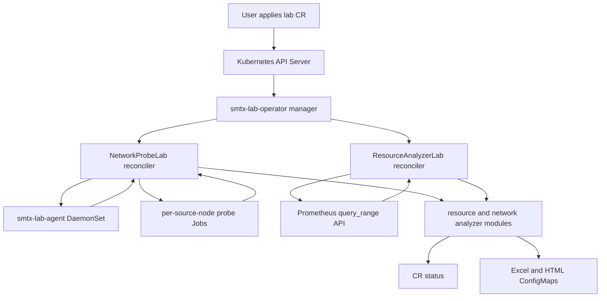
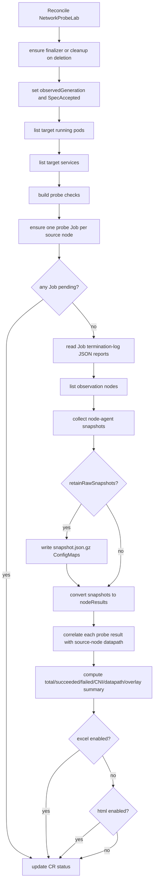
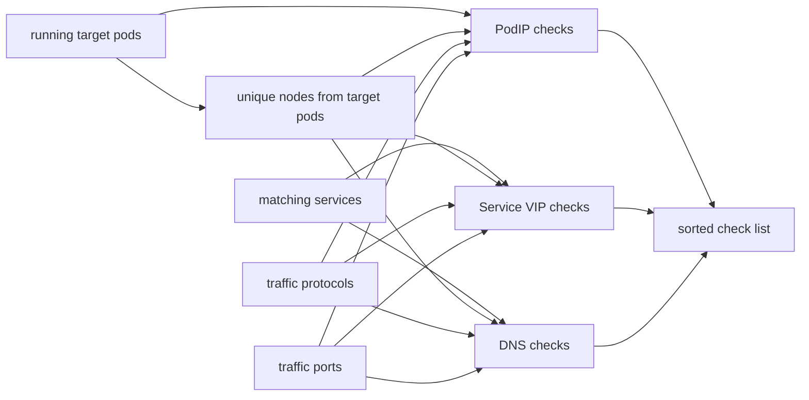
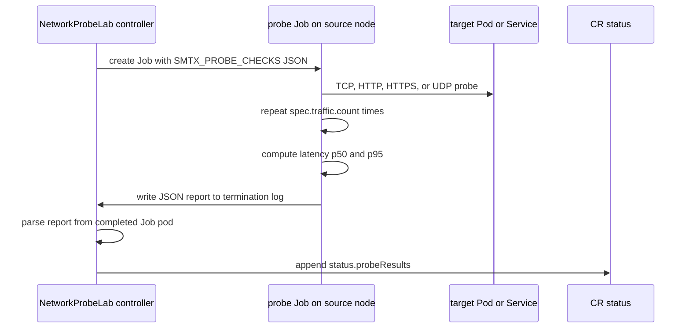
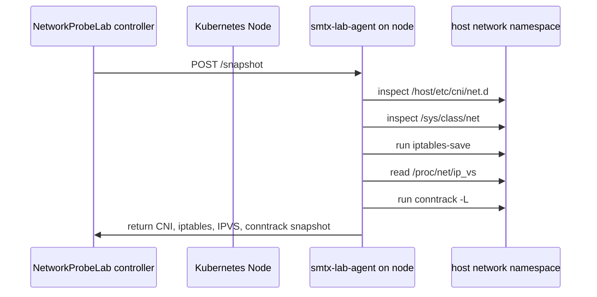
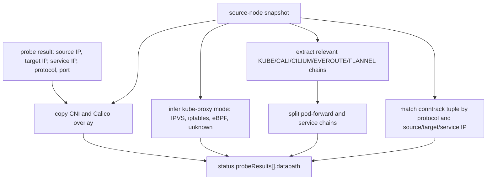
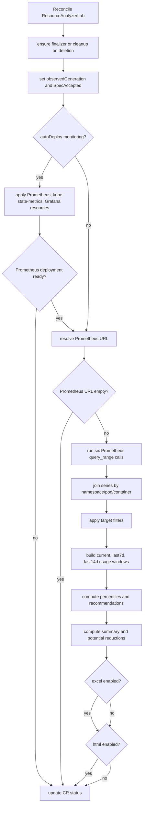

# CR Implementation Flow and Validation

This document records the detailed implementation flow for the two lab CRs:

- `NetworkProbeLab`
- `ResourceAnalyzerLab`

It also records the 2026-06-19 validation run against the Calico cluster and
shows how the controller calculations match the observed CR status.

## Evidence Snapshot

Validation time:

- Local time: 2026-06-19 00:22 Asia/Shanghai
- Cluster evidence time: 2026-06-18T16:22Z

Evidence directory:

```text
/Users/mw/lab/codex/crd/e2e-artifacts/flow-doc-20260619-002315
```

Important evidence files:

| File | Purpose |
| --- | --- |
| `networkprobelab.yaml` | Full `NetworkProbeLab` CR including status |
| `networkprobelab.json` | Machine-readable network status used for reconciliation |
| `network-count-reconciliation.json` | Expected vs actual network probe count |
| `network-node-datapath-reconciliation.json` | Per-node CNI, overlay, chain counts, conntrack counts |
| `network-probe-results.html` | HTML network report artifact |
| `network-probe-results.xlsx` | Excel network report artifact |
| `resourceanalyzerlab.yaml` | Full `ResourceAnalyzerLab` CR including status |
| `resourceanalyzerlab.json` | Machine-readable resource status used for reconciliation |
| `resource-recommendation-reconciliation.json` | Expected vs actual recommendation and summary check |
| `resource-formula-examples.json` | Example recommendation inputs and outputs |
| `resource-recommendations.html` | HTML resource report artifact |
| `resource-recommendations.xlsx` | Excel resource report artifact |

Unit test command used in this workspace:

```bash
CGO_ENABLED=0 GOPROXY=https://goproxy.cn,direct /tmp/smtx-go/go/bin/go test ./...
```

Result:

```text
ok github.com/smtx-lab/smtx-lab-operator/internal/analyzer
ok github.com/smtx-lab/smtx-lab-operator/internal/controller
ok github.com/smtx-lab/smtx-lab-operator/internal/exporter
```

The remaining packages have no test files.

## High-Level Architecture



The controllers are implemented under `internal/controller`. Shared API types
are under `api/v1alpha1`, network/resource analysis is under
`internal/analyzer`, Prometheus access is under `internal/metrics`, probe job
logic is under `cmd/probe`, and node snapshot collection is under
`cmd/agent` plus `internal/agent`.

## NetworkProbeLab Implementation

### CR Input Surface

The `NetworkProbeLab` spec drives four things:

| Spec section | Implementation role |
| --- | --- |
| `spec.target.namespaces` | Namespace filter for target pods and services |
| `spec.target.podSelector` | Selects running target pods with `podIP` and `nodeName` |
| `spec.target.serviceSelector` | Selects services for ClusterIP and DNS checks |
| `spec.target.nodeSelector` | Restricts allowed source and observation nodes |
| `spec.traffic.protocols` | Expands checks by protocol, default `TCP` |
| `spec.traffic.ports` | Expands checks by port, otherwise service/pod/default port discovery |
| `spec.traffic.crossNodeOnly` | Removes pod-IP checks where source node equals target node |
| `spec.traffic.includePodIP` | Enables direct PodIP checks |
| `spec.traffic.includeServiceVIP` | Enables ClusterIP checks |
| `spec.traffic.includeDNS` | Enables service DNS checks |
| `spec.observability.*` | Controls CNI, iptables, IPVS, conntrack, route snapshot fields |
| `spec.output.excel/html` | Writes report ConfigMaps and status artifact names |
| `spec.output.retainRawSnapshots` | Writes gzipped per-node raw snapshot ConfigMaps |

Status contains:

- `observedGeneration`
- `phase`
- conditions: `SpecAccepted`, `AgentReady`, `ProbeCompleted`,
  `ExcelExported`, `HTMLExported`, `RawSnapshotsExported`
- `summary`
- `nodeResults`
- `probeResults`
- `artifacts`

### Reconcile Flow



The controller first writes artifact names into status from the configured
ConfigMap names. It then runs `runNetworkProbe`. If Jobs are not complete, phase
is `Running` and the controller requeues. If all Jobs finish, the controller
collects node snapshots, correlates datapath, writes reports, and sets phase to
`Succeeded` when `summary.failed == 0`.

### Probe Check Generation

The implementation builds checks from selected target pods/services:



For PodIP checks, `crossNodeOnly=true` filters out targets on the same source
node. Service VIP and DNS checks are still executed from every source node
because a ClusterIP or DNS name is not tied to a single target pod in the check
definition.

Formula:

```text
podIP checks =
  sum_for_each_source_node(count(targetPods where target.node != source.node))
  * protocol_count
  * port_count

serviceVIP checks =
  source_node_count
  * service_count
  * protocol_count
  * service_port_count

dns checks =
  source_node_count
  * service_count
  * protocol_count
  * service_port_count

total checks = podIP checks + serviceVIP checks + dns checks
```

### Probe Job Execution



Each source node gets one Job. The Job is scheduled by `spec.nodeName`, receives
checks in `SMTX_PROBE_CHECKS`, and records a JSON report in the pod termination
message. The controller reads that termination message after completion.

### Node Agent Snapshot Flow



The collection is bounded and read-only from the operator perspective. The node
agent applies:

- `iptables-save`, then optional chain allowlist filtering
- `/proc/net/ip_vs` parsing for IPVS service and real-server counts
- `conntrack -L`, then protocol and max-entry filtering
- CNI detection from config content and host interface names

### CNI and Calico Overlay Detection

Detection rules in the current implementation:

| Signal | Result |
| --- | --- |
| CNI config contains `calico` | `type=calico`, `mode=iptables` |
| host interface starts with `cali` | Calico workload interface |
| host interface `tunl0` | Calico IPIP interface |
| host interface `vxlan.calico` | Calico VXLAN interface |
| config hint contains `ipip` | Calico overlay includes `ipip` |
| config hint contains `vxlan` | Calico overlay includes `vxlan` |
| config hint contains `wireguard` | Calico overlay includes `wireguard` |
| no Calico overlay signal | `none-or-bgp` |

For the Calico validation cluster, every node reported:

```text
CNI: calico
overlay: ipip
IPIP interface: tunl0
VXLAN interface: empty
```

### iptables Chain Classification

The analyzer splits captured iptables chains into two status groups:

| Category | Matching chains | Purpose |
| --- | --- | --- |
| `pod-forward` | `cali-*`, `KUBE-FORWARD` | Calico workload policy/routing and kube-proxy forwarding paths |
| `service` | `KUBE-SERVICES`, `KUBE-SVC-*`, `KUBE-SEP-*`, `KUBE-EXT-*`, `KUBE-NODEPORTS`, `KUBE-EXTERNAL-SERVICES`, `KUBE-MARK-MASQ`, `KUBE-POSTROUTING` | kube-proxy Service VIP, endpoint DNAT, NodePort, and masquerade paths |

Representative purpose mapping:

| Chain pattern | Status group | Remark |
| --- | --- | --- |
| `KUBE-FORWARD` | pod-forward | kube-proxy forwarding chain permitting service and pod forwarding paths |
| `cali-FORWARD` | pod-forward | Calico policy and routing hook for forwarded pod traffic |
| `cali-from-wl-dispatch` | pod-forward | Dispatches packets leaving workload interfaces |
| `cali-to-wl-dispatch` | pod-forward | Dispatches packets entering workload interfaces |
| `cali-fw-*` | pod-forward | Calico from-workload policy chain for one workload endpoint |
| `cali-tw-*` | pod-forward | Calico to-workload policy chain for one workload endpoint |
| `cali-pri-*` / `cali-pro-*` | pod-forward | Calico profile policy chains |
| `KUBE-SERVICES` | service | kube-proxy service VIP entry chain |
| `KUBE-SVC-*` | service | kube-proxy per-Service load-balancing chain |
| `KUBE-SEP-*` | service | kube-proxy per-endpoint DNAT chain |
| `KUBE-EXT-*` | service | kube-proxy external traffic policy chain |
| `KUBE-MARK-MASQ` | service | marks packets requiring masquerade |
| `KUBE-POSTROUTING` | service | postrouting masquerade chain |

The complete per-node chain list is in:

```text
/Users/mw/lab/codex/crd/e2e-artifacts/flow-doc-20260619-002315/networkprobelab.yaml
```

Useful command to inspect the full chain list:

```bash
jq -r '
  .status.nodeResults[]
  | .nodeName as $node
  | (.iptables.podChains[]?, .iptables.serviceChains[]?)
  | [$node, .category, .name, (.ruleCount // 0), .purpose]
  | @tsv
' networkprobelab.json
```

### Datapath Correlation



Current implementation correlates a probe with the snapshot from the source
node. The result does not claim packet-level tracing; it records the datapath
evidence available on that source node at analysis time.

## NetworkProbeLab Validation Result

Current target workload:

| Item | Value |
| --- | --- |
| namespace | `test` |
| pods | `nginx-6645f45b6-hc4b6`, `nginx-6645f45b6-wzzp6` |
| pod IPs | `172.31.224.145`, `172.31.227.14` |
| pod nodes | `sida-workergroup1-2pl8k-xkxhl`, `sida-workergroup1-2pl8k-zvz5b` |
| service | `nginx` |
| service IP | `10.250.254.63` |
| protocols | `TCP`, `HTTP` |
| ports | `80` |
| probe count per check | `6` |

Count reconciliation:

| Calculation | Value |
| --- | ---: |
| source nodes | 2 |
| running target pods | 2 |
| services | 1 |
| protocols | 2 |
| ports | 1 |
| cross-node Pod pairs | 2 |
| expected PodIP checks | 2 * 2 * 1 = 4 |
| expected ServiceVIP checks | 2 * 1 * 2 * 1 = 4 |
| expected DNS checks | 2 * 1 * 2 * 1 = 4 |
| expected total | 12 |
| actual `status.summary.totalTests` | 12 |
| actual `status.summary.succeeded` | 12 |
| actual failed | 0 |

Path and protocol distribution:

| Dimension | Result |
| --- | --- |
| by path | `podIP=4`, `serviceVIP=4`, `dns=4` |
| by protocol | `TCP=6`, `HTTP=6` |
| by source node | `sida-workergroup1-2pl8k-xkxhl=6`, `sida-workergroup1-2pl8k-zvz5b=6` |

Example cross-node PodIP results:

| Source Pod IP | Source Node IP | Target Pod IP | Target Node IP | Protocol | Path | p95 ms | CNI | Overlay | kube-proxy |
| --- | --- | --- | --- | --- | --- | ---: | --- | --- | --- |
| `172.31.224.154` | `192.168.112.133` | `172.31.227.14` | `192.168.112.132` | TCP | podIP | 1.2065 | calico | ipip | iptables |
| `172.31.224.154` | `192.168.112.133` | `172.31.227.14` | `192.168.112.132` | HTTP | podIP | 2.92525 | calico | ipip | iptables |
| `172.31.227.27` | `192.168.112.132` | `172.31.224.145` | `192.168.112.133` | TCP | podIP | 1.99125 | calico | ipip | iptables |
| `172.31.227.27` | `192.168.112.132` | `172.31.224.145` | `192.168.112.133` | HTTP | podIP | 0.73925 | calico | ipip | iptables |

Per-node datapath summary:

| Node | CNI | Overlay | IPIP iface | VXLAN iface | Pod chains | Service chains | IPVS enabled | Conntrack entries |
| --- | --- | --- | --- | --- | ---: | ---: | --- | ---: |
| `sida-controlplane-t6kdn` | calico | ipip | `tunl0` | empty | 40 | 65 | false | 501 |
| `sida-workergroup1-2pl8k-xkxhl` | calico | ipip | `tunl0` | empty | 91 | 65 | false | 578 |
| `sida-workergroup1-2pl8k-zvz5b` | calico | ipip | `tunl0` | empty | 105 | 65 | false | 419 |

Current network CR status summary:

```yaml
phase: Succeeded
observedGeneration: 7
summary:
  totalTests: 12
  succeeded: 12
  cniDetected:
  - calico
  datapathModes:
  - iptables
  calicoOverlayModes:
  - ipip
artifacts:
  excelConfigMapName: network-probe-lab-report
  htmlConfigMapName: network-probe-lab-html-report
```

Probe Jobs from the rerun:

| Job | Started | Completed | Result |
| --- | --- | --- | --- |
| `npl-cross-node-network-lab-4d1daf7cc8` | 2026-06-18T16:22:01Z | 2026-06-18T16:22:04Z | 1/1 |
| `npl-cross-node-network-lab-5a15f7b863` | 2026-06-18T16:22:01Z | 2026-06-18T16:22:04Z | 1/1 |

## ResourceAnalyzerLab Implementation

### CR Input Surface

The `ResourceAnalyzerLab` spec drives five things:

| Spec section | Implementation role |
| --- | --- |
| `spec.target.namespaces` | Optional namespace allowlist |
| `spec.target.excludeNamespaces` | Namespace denylist, current sample excludes `kube-system` |
| `spec.target.workloadKinds` | Optional workload kind filter |
| `spec.metrics.prometheusURL` | Explicit Prometheus URL, optional when auto-deploy is enabled |
| `spec.metrics.lookbackDays` | Query window, default 14 days |
| `spec.metrics.step` | Prometheus `query_range` step, default `5m` |
| `spec.metrics.timeoutSeconds` | Query timeout, default 30 seconds |
| `spec.recommendation.cpu/memory` | Percentiles, headroom, and minimum request settings |
| `spec.recommendation.languageHints` | Runtime-specific headroom tuning |
| `spec.monitoringStack.autoDeploy` | Creates Prometheus, kube-state-metrics, and optional Grafana |
| `spec.output.excel/html` | Writes report ConfigMaps and status artifact names |

Status contains:

- `observedGeneration`
- `phase`
- conditions: `SpecAccepted`, `MonitoringStackReady`, `PrometheusReachable`,
  `AnalysisCompleted`, `ExcelExported`, `HTMLExported`
- `summary`
- `recommendations`
- `artifacts`

### Reconcile Flow



### Prometheus Queries

The controller uses `query_range` with:

```text
start = end - spec.metrics.lookbackDays * 24h
end = controller current UTC time
step = spec.metrics.step, default 5m
```

PromQL used by the current implementation:

| Metric role | PromQL |
| --- | --- |
| CPU usage | `sum by (namespace,pod,container) (rate(container_cpu_usage_seconds_total{container!="",image!=""}[5m]))` |
| Memory working set | `container_memory_working_set_bytes{container!="",image!=""}` |
| CPU requests | `kube_pod_container_resource_requests{resource="cpu"}` |
| Memory requests | `kube_pod_container_resource_requests{resource="memory"}` |
| CPU limits | `kube_pod_container_resource_limits{resource="cpu"}` |
| Memory limits | `kube_pod_container_resource_limits{resource="memory"}` |

The analyzer joins all series by:

```text
namespace + pod + container
```

It ignores empty containers and the Kubernetes infra container named `POD`.

### Usage Windows

For every container, the analyzer builds:

| Window | Meaning |
| --- | --- |
| `current` | latest CPU sample and latest memory sample |
| `last7d` | min, avg, max over samples with timestamp in the last 7 days |
| `last14d` | min, avg, max over samples with timestamp in the last 14 days |

Values are converted with ceiling:

```text
CPU cores -> millicores = ceil(cores * 1000)
memory bytes -> MiB = ceil(bytes / 1024 / 1024)
```

If Prometheus only contains less than 14 days of samples, the query still uses a
14-day range, but the window contains the samples actually returned by
Prometheus. In the validation run, several containers had `sampleCount: 97`
because the auto-deployed monitoring stack had not been running for 14 full
days.

### Percentile Calculation

Percentiles are computed by sorting samples and linearly interpolating:

```text
rank = percentile * (sample_count - 1)
lower = floor(rank)
upper = ceil(rank)
value = sorted[lower] * (1 - weight) + sorted[upper] * weight
weight = rank - lower
```

The status records:

- `observed.cpuP50Millicores`
- `observed.cpuP95Millicores`
- `observed.cpuP99Millicores`
- `observed.memoryP50MiB`
- `observed.memoryP95MiB`
- `observed.memoryP99MiB`

### Recommendation Formula

The current implementation intentionally does not use valley/min as request
directly. It uses `max(percentile, 14d average)` for request and
`max(percentile, 14d peak)` for limit. This prevents a low valley sample from
recommending an unsafe request.

Configured policy in the validation CR:

```yaml
cpu:
  requestPercentile: p95
  limitPercentile: p99
  requestHeadroomRatio: 1.2
  limitHeadroomRatio: 1.5
  minRequestMillicores: 50
memory:
  requestPercentile: p95
  limitPercentile: p99
  requestHeadroomRatio: 1.15
  limitHeadroomRatio: 1.3
  minRequestMiB: 64
languageHints:
  default: Go
```

CPU formula:

```text
cpuRequestBase = max(cpuP95, last14d.cpuAvg)
cpuRequestRaw = max(ceil(cpuRequestBase * requestHeadroomRatio), minCpuRequest)
cpuRequest = roundCpu(cpuRequestRaw)

cpuLimitBase = max(cpuP99, last14d.cpuMax)
cpuLimitRaw = ceil(cpuLimitBase * languageCpuLimitHeadroom)
cpuLimit = roundCpu(cpuLimitRaw)
if cpuLimit > 0 and cpuLimit < cpuRequest:
  cpuLimit = cpuRequest
```

Memory formula:

```text
memoryRequestBase = max(memoryP95, last14d.memoryAvg)
memoryRequestRaw = max(ceil(memoryRequestBase * languageMemoryRequestHeadroom), minMemoryRequest)
memoryRequest = roundMemory(memoryRequestRaw)

memoryLimitBase = max(memoryP99, last14d.memoryMax)
memoryLimitRaw = ceil(memoryLimitBase * languageMemoryLimitHeadroom)
memoryLimit = roundMemory(memoryLimitRaw)
if memoryLimit > 0 and memoryLimit < memoryRequest:
  memoryLimit = memoryRequest
```

Rounding:

```text
roundCpu(value):
  value <= 100m  -> round up to 10m
  value > 100m   -> round up to 50m

roundMemory(value):
  value <= 512Mi -> round up to 32Mi
  value > 512Mi  -> round up to 128Mi
```

Language headroom:

| Language | CPU limit | Memory request | Memory limit |
| --- | ---: | ---: | ---: |
| Go/default | max(configured, 1.2) | max(configured, 1.1) | max(configured, 1.25) |
| Java | max(configured, 1.5) | max(configured, 1.25) | max(configured, 1.5) |
| Python | max(configured, 1.4) | max(configured, 1.2) | max(configured, 1.35) |

With the validation policy and default `Go`, the effective ratios were:

```text
CPU request: 1.2
CPU limit: 1.5
Memory request: 1.15
Memory limit: 1.3
```

## ResourceAnalyzerLab Validation Result

Current resource CR status summary:

```yaml
phase: Succeeded
observedGeneration: 4
summary:
  analyzedNamespaces: 10
  analyzedWorkloads: 62
  analyzedContainers: 86
  recommendedChanges: 86
  potentialCpuRequestReductionMillicores: 1888
  potentialMemoryRequestReductionMiB: 2606
artifacts:
  excelConfigMapName: resource-analyzer-report
  htmlConfigMapName: resource-analyzer-html-report
```

The independent reconciliation file shows:

```json
{
  "recommendations": 86,
  "computedSummary": {
    "analyzedContainers": 86,
    "analyzedNamespaces": 10,
    "analyzedWorkloads": 62,
    "recommendedChanges": 86,
    "potentialCpuRequestReductionMillicores": 1888,
    "potentialMemoryRequestReductionMiB": 2606
  },
  "formulaMismatches": []
}
```

This means:

- status recommendation count equals `status.summary.analyzedContainers`
- namespace and workload counts recomputed from recommendations match status
- positive current-request minus recommended-request sums match status
- every recommendation was recomputed from formula with zero mismatches

### Example Calculation 1: kapp-controller

Container:

```text
kapp-controller/kapp-controller-65b6c57cd9-8tv9k/kapp-controller
```

Observed and usage inputs:

| Input | Value |
| --- | ---: |
| current CPU request | 120m |
| current CPU limit | 2000m |
| current memory request | 100Mi |
| current memory limit | 2048Mi |
| CPU p95 | 61m |
| CPU p99 | 63m |
| 14d CPU avg | 50m |
| 14d CPU max | 66m |
| memory p95 | 116Mi |
| memory p99 | 192Mi |
| 14d memory avg | 102Mi |
| 14d memory max | 226Mi |

CPU request:

```text
base = max(61, 50) = 61
raw = ceil(61 * 1.2) = 74
min = max(74, 50) = 74
roundCpu(74) = 80
```

CPU limit:

```text
base = max(63, 66) = 66
raw = ceil(66 * 1.5) = 99
roundCpu(99) = 100
max(limit, request) = max(100, 80) = 100
```

Memory request:

```text
base = max(116, 102) = 116
raw = ceil(116 * 1.15) = 134
min = max(134, 64) = 134
roundMemory(134) = 160
```

Memory limit:

```text
base = max(192, 226) = 226
raw = ceil(226 * 1.3) = 294
roundMemory(294) = 320
max(limit, request) = max(320, 160) = 320
```

Status recommendation:

```yaml
recommended:
  cpuRequestMillicores: 80
  cpuLimitMillicores: 100
  memoryRequestMiB: 160
  memoryLimitMiB: 320
```

The calculation matches status exactly.

### Example Calculation 2: nginx Test Workload

Container:

```text
test/nginx-6645f45b6-hc4b6/nginx
```

Observed and usage inputs:

| Input | Value |
| --- | ---: |
| current CPU request | 100m |
| current CPU limit | 500m |
| current memory request | 256Mi |
| current memory limit | 512Mi |
| CPU p95 | 1m |
| CPU p99 | 1m |
| 14d CPU avg | 1m |
| 14d CPU max | 1m |
| memory p95 | 8Mi |
| memory p99 | 8Mi |
| 14d memory avg | 8Mi |
| 14d memory max | 8Mi |

CPU request:

```text
base = max(1, 1) = 1
raw = ceil(1 * 1.2) = 2
min = max(2, 50) = 50
roundCpu(50) = 50
```

CPU limit:

```text
base = max(1, 1) = 1
raw = ceil(1 * 1.5) = 2
roundCpu(2) = 10
max(limit, request) = max(10, 50) = 50
```

Memory request:

```text
base = max(8, 8) = 8
raw = ceil(8 * 1.15) = 10
min = max(10, 64) = 64
roundMemory(64) = 64
```

Memory limit:

```text
base = max(8, 8) = 8
raw = ceil(8 * 1.3) = 11
roundMemory(11) = 32
max(limit, request) = max(32, 64) = 64
```

Status recommendation:

```yaml
recommended:
  cpuRequestMillicores: 50
  cpuLimitMillicores: 50
  memoryRequestMiB: 64
  memoryLimitMiB: 64
```

The calculation matches status exactly.

### Usage Window Example

For `kapp-controller/kapp-controller-65b6c57cd9-8tv9k/kapp-controller`:

| Window | Samples | CPU min | CPU avg | CPU max | Memory min | Memory avg | Memory max |
| --- | ---: | ---: | ---: | ---: | ---: | ---: | ---: |
| current | 1 | 52m | 52m | 52m | 95Mi | 95Mi | 95Mi |
| last7d | 97 | 6m | 50m | 66m | 81Mi | 102Mi | 226Mi |
| last14d | 97 | 6m | 50m | 66m | 81Mi | 102Mi | 226Mi |

The 7-day and 14-day windows are identical in this run because the monitoring
stack only had 97 samples for this container.

## Report Artifacts

Network reports:

```bash
kubectl -n smtx-lab-system get cm network-probe-lab-report \
  -o jsonpath='{.binaryData.network-probe-results\.xlsx}' | base64 -d > network-probe-results.xlsx

kubectl -n smtx-lab-system get cm network-probe-lab-html-report \
  -o jsonpath='{.binaryData.network-probe-results\.html}' | base64 -d > network-probe-results.html
```

Resource reports:

```bash
kubectl -n smtx-lab-system get cm resource-analyzer-report \
  -o jsonpath='{.binaryData.resource-recommendations\.xlsx}' | base64 -d > resource-recommendations.xlsx

kubectl -n smtx-lab-system get cm resource-analyzer-html-report \
  -o jsonpath='{.binaryData.resource-recommendations\.html}' | base64 -d > resource-recommendations.html
```

The HTML reports are intended for human reading, with dashboard-style summary
cards, grouped tables, and high-signal sections similar to a Grafana report.

## Completion Checklist

| Requirement | Evidence |
| --- | --- |
| Network CR implementation flow documented | Network flowcharts and sections above |
| Resource CR implementation flow documented | Resource flowcharts and sections above |
| Network calculation matches test results | `expectedTotal=12`, `actualTotal=12`, `actualSucceeded=12` |
| Resource calculation matches test results | `formulaMismatches=[]`, computed summary equals status summary |
| Unit tests rerun | `go test ./...` passed with `/tmp/smtx-go/go/bin/go` |
| Actual cluster CRs rerun | Recheck annotation `lab.smtx.io/recheck=1781799720`; network probe Jobs completed |
| CR status captured | `networkprobelab.yaml`, `resourceanalyzerlab.yaml` |
| Excel and HTML artifacts captured | four report files in the evidence directory |
